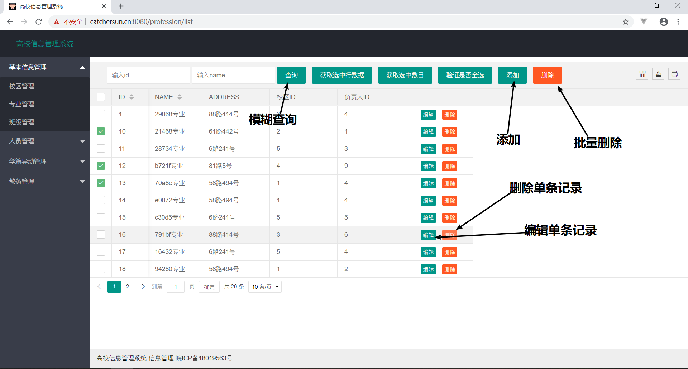
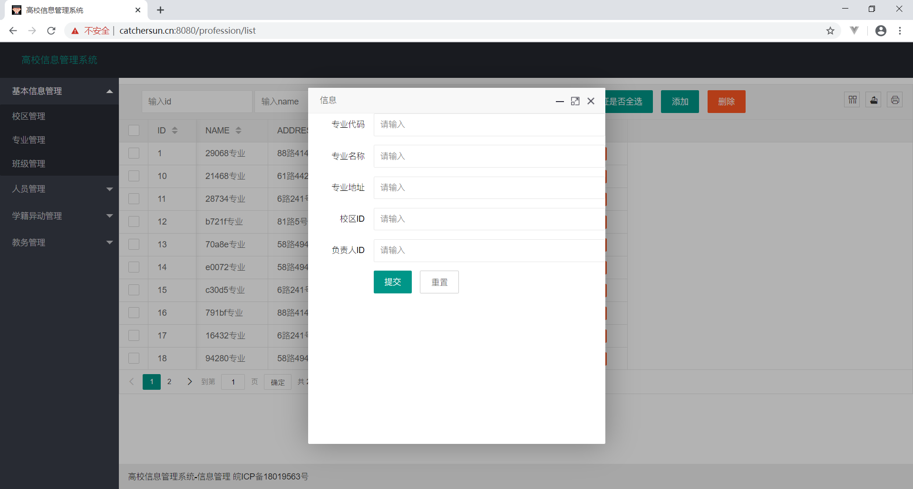
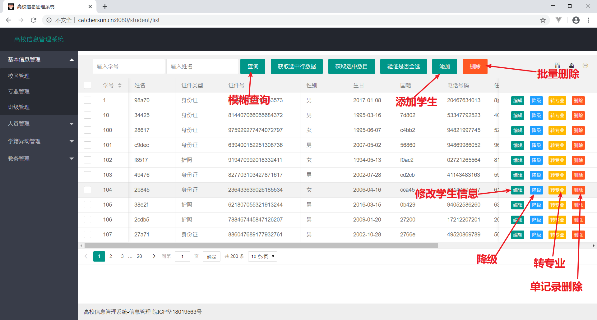
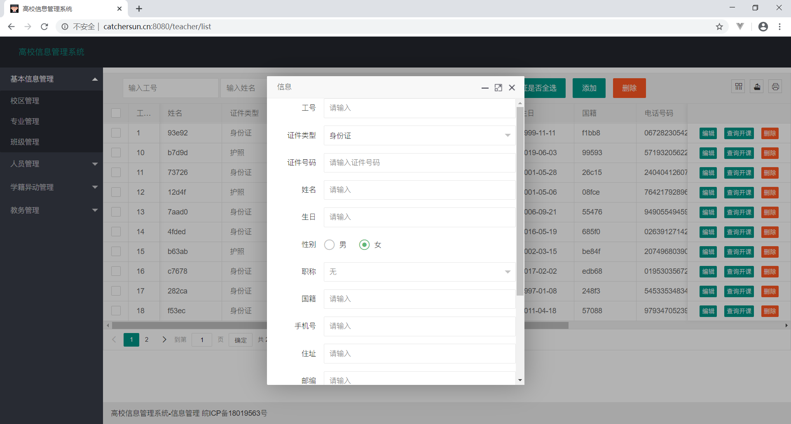
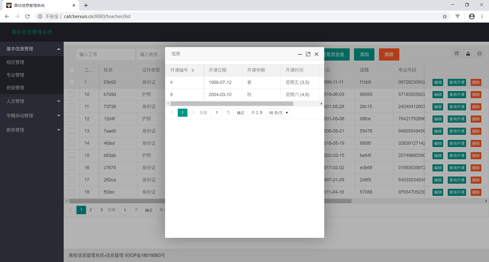

### 专业管理

主要的功能有专业的增删查改

以下是部分功能说明：

#### 添加专业

专业代码是主键必填，最后两项是外键，可以为空

重置按钮将所有表项清空

#### 删除专业

支持单条记录删除（每行的最右边删除按钮）和批量删除（选择多条记录后单击右上角的删除）

#### 查询专业

查询的输入有id和专业名

#### 修改专业

每个表项右边都有编辑按钮，修改界面和添加界面相同，但是专业代码一栏不可修改

表单修改后未提交前，点击重置按钮，表单就会恢复到原来的值

### 学生信息管理

支持学生信息的增删查改，以及降级和转专业

 

 #### 添加学生

 学号是主键，最后一项班级ID是外键

 

#### 删除学生

支持单条记录删除（每行的最右边删除按钮）和批量删除（选择多条记录后单击右上角的删除）

#### 查询学生

查询的输入有学号和学生姓名

#### 修改学生

每个表项右边都有编辑按钮，修改界面和添加界面相同，但是专业代码一栏不可修改

表单修改后未提交前，点击重置按钮，表单就会恢复到原来的值

#### 降级和转专业

每条学生记录的右边有降级和转专业按钮，方便对学生进行异动处理

异动ID是主键, 原班级和学号自动填写，不可修改

如果异动记录还未存在，则创建异动记录；如果已经存在，则功能是修改异动记录

### 教师信息管理

主要功能有教师信息的增删查改，以及教师开课信息的查询

#### 添加教师

主键是工号，专业ID是外键

重置按钮清空所有表项

#### 删除教师

支持单条记录删除（每行的最右边删除按钮）和批量删除（选择多条记录后单击右上角的删除）

#### 查询教师

查询的输入有工号和姓名

#### 修改教师

每个表项右边都有编辑按钮，修改界面和添加界面相同，但是工号一栏不可修改

表单修改后未提交前，点击重置按钮，表单就会恢复到原来的值

#### 查询开课

每条教师记录的右侧有查询开课按钮，点击后可以看到该教师开的所有课程

### 教师开课管理

主要功能有开课信息的增删查改

#### 添加开课

主键是开课编号，外键开课教师ID必填

重置按钮清空所有表项

#### 删除开课记录

支持单条记录删除（每行的最右边删除按钮）和批量删除（选择多条记录后单击右上角的删除）

#### 查询开课记录

查询的输入有课程编号，教师工号，开课日期的起止范围

#### 修改开课记录

每个表项右边都有编辑按钮，修改界面和添加界面相同，但是开课编号一栏不可修改

表单修改后未提交前，点击重置按钮，表单就会恢复到原来的值
