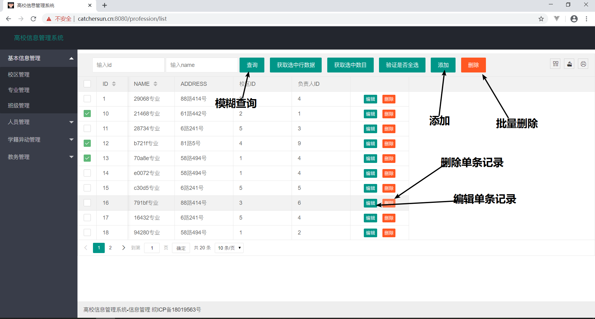
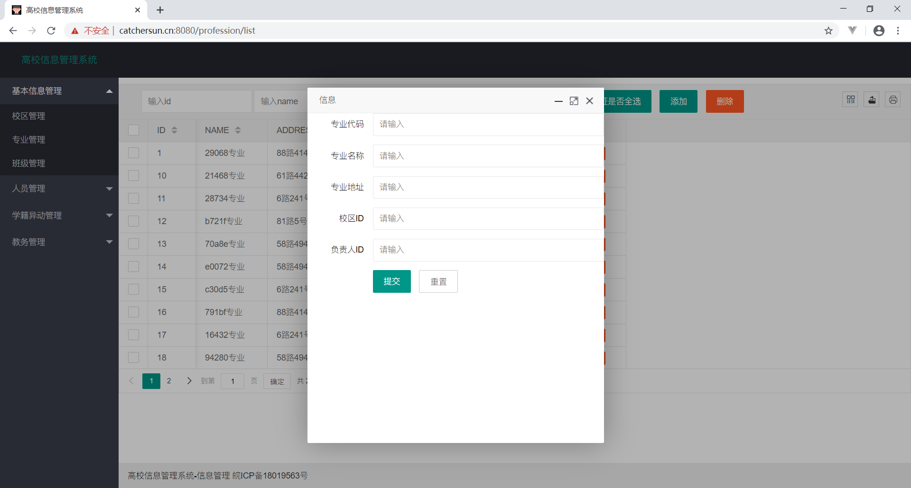
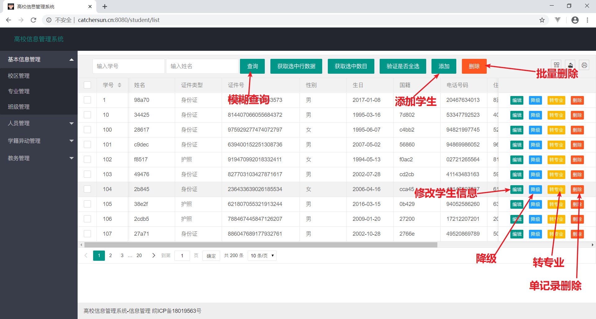
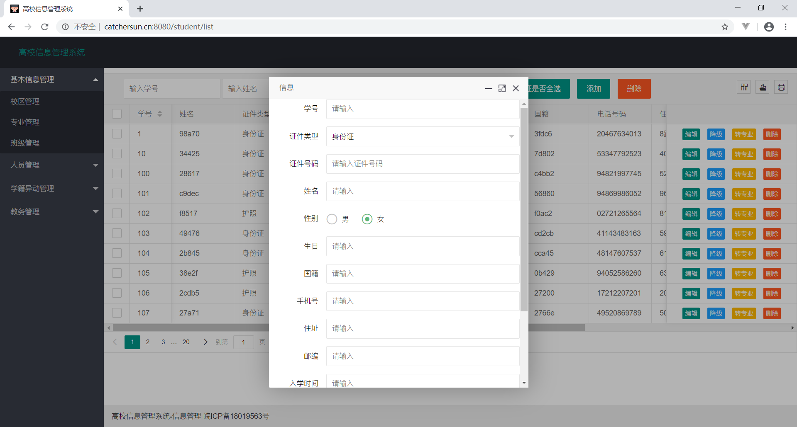
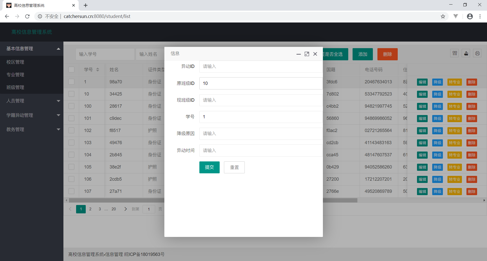
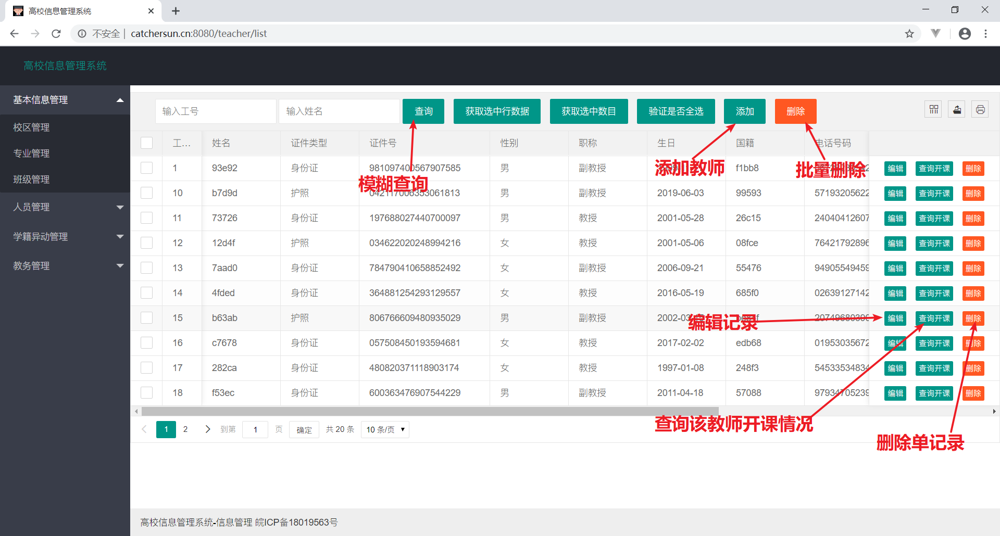
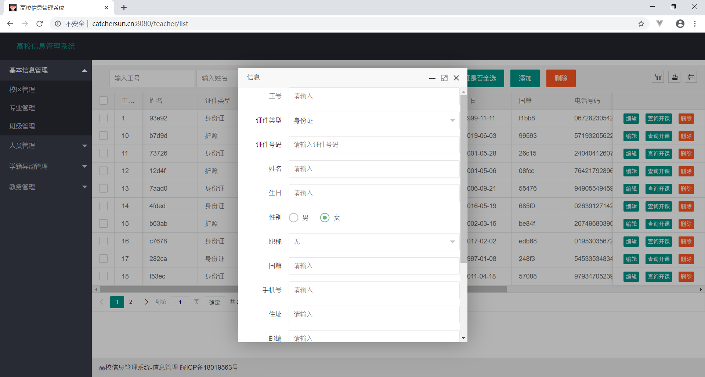
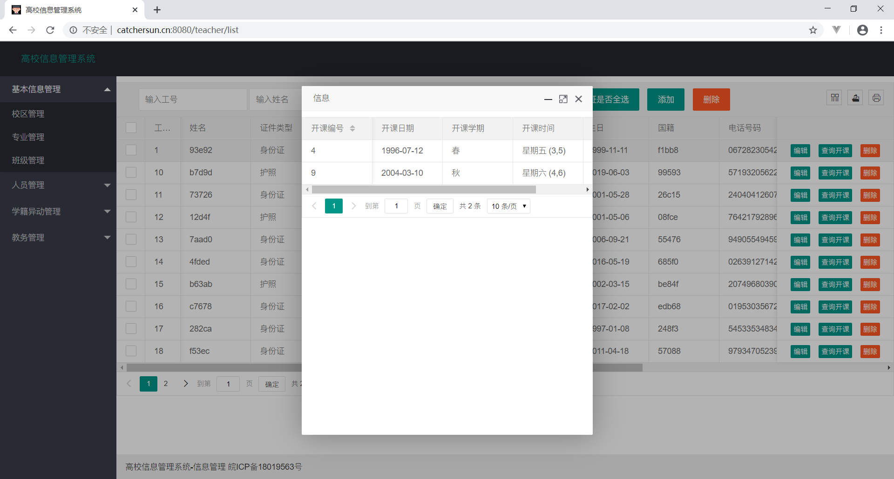
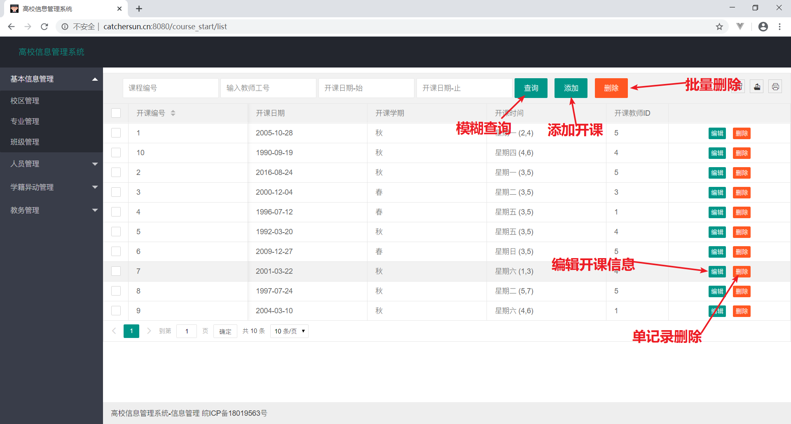
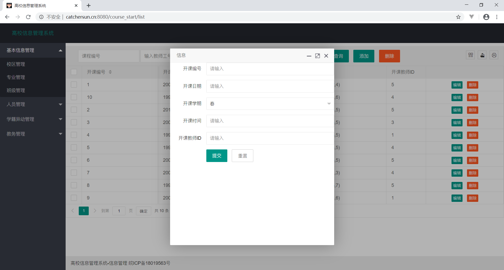

# 高校信息管理系统

[toc]

## 概述

- 实验目的：根据要求设计一个高校信息管理系统

- 实验环境：
  - 开发环境：IntelliJ IDEA ，MySQL Workbench
  - 互动环境：LUG GitLab [仓库地址](https://git.lug.ustc.edu.cn/database/1st-project)
  - 测试环境：POSTMAN
  - 部署环境：系统：CentOS8.0 服务器：阿里云
  - 后端框架：Spring MVC+SpringBoot+MyBatis
  - 前端框架：Lay UI+JQuery
  - 数据库：MySQL
  
- 实验结果：系统设计测试完成之后，打包发布到：[高校信息管理系统](http://catchersun.cn:8080/) 

  但是由于服务器和框架版本问题，转专业页面的功能在服务器端不能完全实现。本地都是完全正确的。

- 部署过程：本地部署，先导入Lab3.sql,再导入test.sql；用IntelliJ IDEA或者其他IDE打开文件，稍等片刻下载依赖；依赖下载完成之后，点击运行，默认路径为localhost:8080/;或者Spring Initialize等IDE或VsCode这类文本编辑器也有对应的安装教程；服务器部署：利用Maven 将项目打包成一个Jar 包，服务器端 `nohup java -jar demo-0.0.1-SNAPSHOT.jar &`  即可让项目在后台一直运行。

---

## 系统总体设计

### 工作流程


### 系统设计


###数据库设计


### 文件结构

共建立了十个类；每个类除了包含Java文件之外还包含了Mapper.xml映射文件。

```txt
//前后端文件
.
├── main
│   ├── java
│   │   └── ssm
│   │       ├── IndexController.java
│   │       ├── SchoolManagerApplication.java
│   │       ├── campus
│   │       │   ├── controller
│   │       │   │   └── CampusController.java
│   │       │   ├── entity
│   │       │   │   └── Campus.java
│   │       │   ├── mapper
│   │       │   │   └── CampusMapper.java
│   │       │   └── service
│   │       │       ├── CampusService.java
│   │       │       └── CampusServiceImpl.java
│   │       ├── clazz
│   │       │   ├── controller
│   │       │   │   └── ClazzController.java
│   │       │   ├── entity
│   │       │   │   └── Clazz.java
│   │       │   ├── mapper
│   │       │   │   └── ClazzMapper.java
│   │       │   └── service
│   │       │       ├── ClazzService.java
│   │       │       └── ClazzServiceImpl.java
│   │       ├── course
│   │       │   ├── controller
│   │       │   │   └── CourseController.java
│   │       │   ├── entity
│   │       │   │   └── Course.java
│   │       │   ├── mapper
│   │       │   │   └── CourseMapper.java
│   │       │   └── service
│   │       │       ├── CourseService.java
│   │       │       └── CourseServiceImpl.java
│   │       ├── coursestart
│   │       │   ├── controller
│   │       │   │   └── CourseStartController.java
│   │       │   ├── entity
│   │       │   │   └── CourseStart.java
│   │       │   ├── mapper
│   │       │   │   └── CourseStartMapper.java
│   │       │   └── service
│   │       │       ├── CourseStartService.java
│   │       │       └── CourseStartServiceImpl.java
│   │       ├── downgrade
│   │       │   ├── controller
│   │       │   │   └── DownGradeController.java
│   │       │   ├── entity
│   │       │   │   └── DownGrade.java
│   │       │   ├── mapper
│   │       │   │   └── DownGradeMapper.java
│   │       │   └── service
│   │       │       ├── DownGradeImpl.java
│   │       │       └── DownGradeService.java
│   │       ├── page
│   │       │   └── Page.java
│   │       ├── profession
│   │       │   ├── controller
│   │       │   │   └── ProfessionController.java
│   │       │   ├── entity
│   │       │   │   └── Profession.java
│   │       │   ├── mapper
│   │       │   │   └── ProfessionMapper.java
│   │       │   └── service
│   │       │       ├── ProfessionService.java
│   │       │       └── ProfessionServiceImpl.java
│   │       ├── score
│   │       │   ├── controller
│   │       │   │   └── ScoreController.java
│   │       │   ├── entity
│   │       │   │   ├── Score.java
│   │       │   │   └── Scores.java
│   │       │   ├── mapper
│   │       │   │   └── ScoreMapper.java
│   │       │   └── service
│   │       │       ├── ScoreService.java
│   │       │       └── ScoreServiceImpl.java
│   │       ├── student
│   │       │   ├── controller
│   │       │   │   └── StudentController.java
│   │       │   ├── entity
│   │       │   │   └── Student.java
│   │       │   ├── mapper
│   │       │   │   └── StudentMapper.java
│   │       │   └── service
│   │       │       ├── StudentService.java
│   │       │       └── StudentServiceImpl.java
│   │       ├── switchmajor
│   │       │   ├── controller
│   │       │   │   └── SwitchMajorController.java
│   │       │   ├── entity
│   │       │   │   └── SwitchMajor.java
│   │       │   ├── mapper
│   │       │   │   └── SwitchMajorMapper.java
│   │       │   └── service
│   │       │       ├── SwitchMajorImpl.java
│   │       │       └── SwitchMajorService.java
│   │       ├── teacher
│   │       │   ├── controller
│   │       │   │   └── TeacherController.java
│   │       │   ├── entity
│   │       │   │   └── Teacher.java
│   │       │   ├── mapper
│   │       │   │   └── TeacherMapper.java
│   │       │   └── service
│   │       │       ├── TeacherService.java
│   │       │       └── TeacherServiceImpl.java
│   │       └── utils
│   │           └── StringUtil.java
│   └── resources
│       ├── application.yml
│       ├── mapper
│       │   ├── CampusMapper.xml
│       │   ├── ClazzMapper.xml
│       │   ├── CourseMapper.xml
│       │   ├── CourseStartMapper.xml
│       │   ├── DownGradeMapper.xml
│       │   ├── ProfessionMapper.xml
│       │   ├── ScoreMapper.xml
│       │   ├── StudentMapper.xml
│       │   ├── SwitchMajorMapper.xml
│       │   └── TeacherMapper.xml
│       ├── mybatis-config.xml
│       ├── public
│       │   └── error
│       │       ├── 404.html
│       │       └── 5xx.html
│       └── static
│           ├── css
│           │   └── style.css
│           ├── forms
│           │   ├── campus_form.html
│           │   ├── clazz_form.html
│           │   ├── course_form.html
│           │   ├── course_start_form.html
│           │   ├── down_grade_form.html
│           │   ├── profession_form.html
│           │   ├── score_form.html
│           │   ├── student_form.html
│           │   ├── switch_major_form.html
│           │   └── teacher_form.html
│           ├── images
│           │   └── schoolmanager.ico
│           ├── layui
│           │   ├── css
│           │   │   ├── layui.css
│           │   │   ├── layui.mobile.css
│           │   │   └── modules
│           │   │       ├── code.css
│           │   │       ├── laydate
│           │   │       │   └── default
│           │   │       │       └── laydate.css
│           │   │       └── layer
│           │   │           └── default
│           │   │               ├── icon-ext.png
│           │   │               ├── icon.png
│           │   │               ├── layer.css
│           │   │               ├── loading-0.gif
│           │   │               ├── loading-1.gif
│           │   │               └── loading-2.gif
│           │   ├── data.json
│           │   ├── font
│           │   │   ├── iconfont.eot
│           │   │   ├── iconfont.svg
│           │   │   ├── iconfont.ttf
│           │   │   ├── iconfont.woff
│           │   │   └── iconfont.woff2
│           │   ├── images
│           │   │   └── face    
│           │   ├── lay
│           │   │   └── modules
│           │   ├── layui.all.js
│           │   └── layui.js
│           └── templates
│               ├── campus
│               │   └── campus_list.html
│               ├── clazz
│               │   └── clazz_list.html
│               ├── course
│               │   └── course_list.html
│               ├── course_start
│               │   └── course_start_list.html
│               ├── down_grade
│               │   └── down_grade_list.html
│               ├── profession
│               │   └── profession_list.html
│               ├── score
│               │   └── score_list.html
│               ├── student
│               │   └── student_list.html
│               ├── switch_major
│               │   └── switch_major_list.html
│               └── teacher
│                   └── teacher_list.html
└── test
    └── java
        └── ssm
            └── SchoolManagerApplicationTests.java
//数据库文件
.
├── Lab3.mwb
├── Lab3.mwb.bak
├── gen_sql.sh//测试数据生成脚本
├── lab3.sql//数据库创建
└── test.sql//数据库数据插入
```

---

## 系统细节设计

前后端通过JSON进行交互，实现完全的分离。

### 后端细节

因为类的大部分接口都相似（增删查改），所以下面挑选代表性的后端接口作出解释：

以Campus校区类为例：

- GET： /list 返回校区列表页面

```java
//校区列表页
    @GetMapping("/list")
    public ModelAndView list(ModelAndView model) {
        model.setViewName("campus/campus_list");
        return model;
    }
```

- POST：/get_list 获得符合条件的校区列表

获得两个参数，一个是校区ID，一个是校区名字，根据这两个参数在数据库中查找到符合要求的项目并返回给前端；page,limit是前端框架默认的分页参数，根据这个在数据库中使用 limit 条件一次返回某范围内的条数。数据库查找返回按照ID从小到大进行排列。

在不同的页面会有不同的查询需求，具体在测试步骤会显示。

```java
//关于校区的ID和名字的模糊查询
    @PostMapping("/get_list")
    @ResponseBody
    public Map<String, Object> getList(
            @RequestParam(value = "name", required = false, defaultValue = "") String name,
            @RequestParam(value = "id", required = false, defaultValue = "") String id,
            @RequestParam(value = "page", required = true) int page,
            @RequestParam(value = "limit", required = true) int limit
    ) {
        Map<String, Object> ret = new HashMap<String, Object>();
        Map<String, Object> queryMap = new HashMap<String, Object>();
        queryMap.put("name", "%" + name + "%");
        queryMap.put("id", "%" + id + "%");
        queryMap.put("offset", (page - 1) * limit);
        queryMap.put("pageSize", page * limit);
        ret.put("rows", campusService.findList(queryMap));
        //符合条件的元组数目
        ret.put("total", campusService.getTotal(queryMap));
        ret.put("rowsAll", campusService.findAll());
        //ret.put("qm",queryMap);
        return ret;
    }
```

- POST：/add 增加一条信息

增加信息时，前端向后端传递JSON字符串自动和对象进行绑定；由于前端框架的自身缺陷，即输入框如果没有输入默认为空串而不是NULL，所以在后端也进行了处理。

```java
    //添加校区信息
    @PostMapping("/add")
    @ResponseBody
    public Map<String, String> add(Campus campus) {
        Map<String, String> ret = new HashMap<String, String>();
        if (StringUtils.isEmpty(campus.getId())) {
            ret.put("type", "error");
            ret.put("msg", "校区ID不能为空！");
            return ret;
        }
        //将空字符串转换成NULL（要命啊）
        if (StringUtils.isEmpty(campus.getName())) {
            ret.put("type", "error");
            ret.put("msg", "校区名称不能为空！");
            return ret;
        }
        if (StringUtils.isEmpty(campus.getAddress())) {
            campus.setAddress(null);
        }
        //用try...catch捕获异常，防止服务器后台直接因为数据库操作失误返回500
        try {
            if (campusService.add(campus) <= 0) {
                ret.put("type", "error");
                ret.put("msg", "校区添加失败！");
                return ret;
            }

        } catch (Exception e) {
            ret.put("type", "error");
            ret.put("msg", "校区添加失败！");
            return ret;
        }
        ret.put("type", "success");
        ret.put("msg", "校区添加成功！");
        //ret.put("campus",campus.toString());
        return ret;
    }
```


- POST：/edit 编辑一条信息

编辑信息时，同添加信息，但是ID不可修改。数据库根据ID来设置对应项其他的值。

```java
@PostMapping("/edit")
    @ResponseBody
    public Map<String, String> edit(Campus campus) {
        Map<String, String> ret = new HashMap<String, String>();
        if (StringUtils.isEmpty(campus.getId())) {
            ret.put("type", "error");
            ret.put("msg", "校区ID不能为空！");
            return ret;
        }
        if (StringUtils.isEmpty(campus.getName())) {
            ret.put("type", "error");
            ret.put("msg", "校区名称不能为空！");
            return ret;
        }
        if (StringUtils.isEmpty(campus.getAddress())) {
            campus.setAddress(null);
        }
        try {
            if (campusService.edit(campus) <= 0) {
                ret.put("type", "error");
                ret.put("msg", "校区信息修改失败！");
                return ret;
            }
        } catch (Exception e) {
            if (campusService.edit(campus) <= 0) {
                ret.put("type", "error");
                ret.put("msg", "校区信息修改失败！");
                return ret;
            }
        }
        ret.put("type", "success");
        ret.put("msg", "校区信息修改成功！");
        return ret;
    }
```

- POST：/delete

传入字符串数组，在后端通过处理，变成'xx','xx',...的字符串后传给数据库，delete .. where id in ('xx','xx’,...)这样的语句删除符合条件的项目。

```java
//删除校区信息
    //可以批量删除：传入函数的是String数组，即可以一次性传入多个元组的ID进行删除
    @PostMapping("/delete")
    @ResponseBody
    public Map<String, String> delete(
            @RequestParam(value = "ids[]", required = true) String[] ids
    ) {
        Map<String, String> ret = new HashMap<String, String>();
        if (ids == null || ids.length == 0) {
            ret.put("type", "error");
            ret.put("msg", "请选择需要删除的数据！");
            return ret;
        }
        String str = StringUtil.joinString(Arrays.asList(ids), ",");
        ret.put("str",str);
        //try{
        if (campusService.delete(StringUtil.joinString(Arrays.asList(ids), ",")) <= 0) {
            ret.put("type", "error");
            ret.put("msg", "校区删除失败！");

            return ret;
        }
        /*    }
        }catch(Exception e){
            ret.put("type","error");
            ret.put("msg","校区存在关联信息，请勿删除！");
            return ret;
        }*/
            ret.put("type", "success");
            ret.put("msg", "校区删除成功！");
            return ret;
        }

```

还有其他条件的查询接口，在测试截图中均有体现。

### 数据库细节

- 外键约束：几乎所有外键都被设置成了UPDATE：NO ACTION，DELETE：NO ACTION，即完成存在关联信息就删除或者更新失败的约束。

- 单表：依赖MyBatis，通过Mapper文件进行映射。将数据库对应表中的列名和实体类的属性一一对应，同时通过SQL语句实现对数据库的操作。

例子：t_campus：

```xml
<?xml version="1.0" encoding="UTF-8"?>
<!DOCTYPE mapper
        PUBLIC "-//mybatis.org//DTD Mapper 3.0//EN"
        "http://mybatis.org/dtd/mybatis-3-mapper.dtd">
<mapper namespace="ssm.campus.mapper.CampusMapper">
    <resultMap id="CampusMap" type="Campus">
        <id property="id" column="campus_id"/>
        <result property="name" column="campus_name"/>
        <result property="address" column="campus_address"/>
    </resultMap>

    <select id="findList" parameterType="Map" resultMap="CampusMap">
        select * from t_campus where 1=1
        <if test="name!=null">
            and campus_name like #{name}
        </if>
        <if test="id!=null">
            and campus_id like #{id}
        </if>
        order by campus_id
        limit #{offset},#{pageSize}
    </select>
    <select id="findAll" resultMap="CampusMap">
        select * from t_campus
    </select>
    <select id="getTotal" parameterType="Map" resultType="Integer">
        select count(campus_id) from t_campus where 1=1
        <if test="name!=null">
            and campus_name like #{name}
        </if>
        <if test="id!=null">
            and campus_id like #{id}
        </if>
    </select>
    <update id="add" parameterType="Campus">
        insert into t_campus(campus_id,campus_name,campus_address)
        values(#{id},#{name},#{address})
    </update>
    <update id="edit" parameterType="Campus">
        update t_campus set campus_name=#{name},campus_address=#{address}
        where campus_id=#{id}
    </update>
    <update id="delete" parameterType="String">

        delete from t_campus where campus_id in (${_value});

    </update>
```

- 一对一跨表

例子：t_switch转专业表中,一个转专业对应一个学生；为了让学生仅有一次转专业机会，在表中将学生学号这个外键设置成了UNIQUE。同时包含了多语句执行，添加和编辑信息之后，对应的学生表中的相应信息（班级）也会修改。

```xml
<?xml version="1.0" encoding="UTF-8"?>
<!DOCTYPE mapper
        PUBLIC "-//mybatis.org//DTD Mapper 3.0//EN"
        "http://mybatis.org/dtd/mybatis-3-mapper.dtd">
<mapper namespace="ssm.switchmajor.mapper.SwitchMajorMapper">
    <resultMap id="SwitchMajorMap" type="SwitchMajor">
        <id property="id" column="switch_id"/>
        <result property="date" column="date"/>
        <result property="member" column="member"/>
        <result property="lastClazzId" column="last_clazz_id"/>
        <result property="nowClazzId" column="now_clazz_id"/>
        <association property="student" javaType="ssm.student.entity.Student">
            <id property="studentId" column="student_id"/>
            <result property="studentPersonId" column="student_person_id"/>
            <result property="studentPersonIdType" column="student_person_id_type"/>
            <result property="studentName" column="student_name"/>
            <result property="studentSex" column="student_sex"/>
            <result property="studentBirthday" column="student_birthday"/>
            <result property="studentCountry" column="student_country"/>
            <result property="studentPhoneNumber" column="student_phone_number"/>
            <result property="studentAddress" column="student_address"/>
            <result property="studentPC" column="student_PC"/>
            <result property="studentStartYear" column="student_start_year"/>
            <result property="studentEmail" column="student_email"/>
            <result property="studentClazzId" column="student_clazz_id"/>
        </association>
    </resultMap>
    <update id="add" parameterType="SwitchMajor">
        update t_student set t_student.student_clazz_id=#{nowClazzId} where t_student.student_id = #{student.studentId};
        insert into t_switch (switch_id, date, member, last_clazz_id, now_clazz_id, student_id)
        values (#{id},#{date},#{member},#{lastClazzId},#{nowClazzId},#{student.studentId});
    </update>
    <update id="edit" parameterType="SwitchMajor">
        update t_student set t_student.student_clazz_id=#{nowClazzId} where t_student.student_id = #{student.studentId};
        update t_switch set date=#{date},
                               member=#{member},
                               last_clazz_id=#{lastClazzId},
                               now_clazz_id=#{nowClazzId}
        where switch_id = #{id} and student_id= #{student.studentId};
    </update>
    <select id="findList" parameterType="Map" resultMap="SwitchMajorMap">
        select t_switch.switch_id,t_switch.date,t_switch.member,t_switch.last_clazz_id,t_switch.now_clazz_id,t_student.*
        from t_switch,t_student where 1=1
        <if test="id!=null">
            and t_switch.switch_id like #{id}
        </if>
        <if test="studentId!=null">
            and t_student.student_id like #{studentId}
        </if>
        and t_student.student_id = t_switch.student_id
        order by t_switch.switch_id
        limit #{offset},#{pageSize};
    </select>

    <update id="delete" parameterType="String">
        delete from t_switch where switch_id in (${_value})
    </update>

    <select id="getTotal" parameterType="Map" resultType="Integer">
        select count(t_switch.switch_id)
        from t_switch,t_student where 1=1
        <if test="id!=null">
            and t_switch.switch_id like #{id}
        </if>
        <if test="studentId!=null">
            and t_student.student_id like #{studentId}
        </if>
        and t_student.student_id = t_switch.student_id;
    </select>
    <select id="findRecord" parameterType="String" resultMap="SwitchMajorMap">
        select t_switch.switch_id,t_switch.date,t_switch.member,t_switch.last_clazz_id,t_switch.now_clazz_id,t_student.*
        from t_switch,t_student where t_switch.student_id=#{studentId} and t_switch.student_id=t_student.student_id;
    </select>

```

- 一对多跨表

例子：t_score;t_student 和t_score，t_course 和t_score分别是一对多关系。所以相比之前的查询新增了两个查询接口：一个是根据学生ID返回这个学生修读的所有课程的详细信息；一个是根据课程ID返回这个课程选课学生的所有详细信息。实体类中通过List实现，对应Mapper中\<connection\> 标签，后端查询结果返回二级JSON。t_score表对应页面为学生修读课程信息页面；在t_score表中，学生ID和课程ID组合成为主键，所以防止了同一学生修读同样课程的情况出现。

```xml
<?xml version="1.0" encoding="UTF-8"?>
<!DOCTYPE mapper
        PUBLIC "-//mybatis.org//DTD Mapper 3.0//EN"
        "http://mybatis.org/dtd/mybatis-3-mapper.dtd">
<mapper namespace="ssm.score.mapper.ScoreMapper">
    <!-- 学生的课程记录-->
    <resultMap id="StudentMap" type="Student">
        <id property="studentId" column="student_id"/>
        <result property="studentPersonId" column="student_person_id"/>
        <result property="studentPersonIdType" column="student_person_id_type"/>
        <result property="studentName" column="student_name"/>
        <result property="studentSex" column="student_sex"/>
        <result property="studentBirthday" column="student_birthday"/>
        <result property="studentCountry" column="student_country"/>
        <result property="studentPhoneNumber" column="student_phone_number"/>
        <result property="studentAddress" column="student_address"/>
        <result property="studentPC" column="student_PC"/>
        <result property="studentStartYear" column="student_start_year"/>
        <result property="studentEmail" column="student_email"/>
        <result property="studentClazzId" column="student_clazz_id"/>
        <collection property="courseList" ofType="Course">
            <id property="courseId" column="course_id"/>
            <result property="courseName" column="course_name"/>
            <result property="courseAssessType" column="course_assess_type"/>
            <result property="professionId" column="course_profession_id"/>
            <result property="score" column="score"/>
        </collection>
    </resultMap>
    <!--课程的学生记录-->
    <resultMap id="CourseMap" type="Course">
        <id property="courseId" column="course_id"/>
        <result property="courseName" column="course_name"/>
        <result property="courseAssessType" column="course_assess_type"/>
        <result property="professionId" column="course_profession_id"/>
        <collection property="studentList" ofType="Student">
            <id property="studentId" column="student_id"/>
            <result property="studentPersonId" column="student_person_id"/>
            <result property="studentPersonIdType" column="student_person_id_type"/>
            <result property="studentName" column="student_name"/>
            <result property="studentSex" column="student_sex"/>
            <result property="studentBirthday" column="student_birthday"/>
            <result property="studentCountry" column="student_country"/>
            <result property="studentPhoneNumber" column="student_phone_number"/>
            <result property="studentAddress" column="student_address"/>
            <result property="studentPC" column="student_PC"/>
            <result property="studentStartYear" column="student_start_year"/>
            <result property="studentEmail" column="student_email"/>
            <result property="studentClazzId" column="student_clazz_id"/>
            <result property="score" column="score"/>
        </collection>
    </resultMap>
    <resultMap id="ScoreMap" type="Score">
        <id property="courseId" column="course_id"/>
        <id property="studentId" column="student_id"/>
        <result property="score" column="score"/>
    </resultMap>

    <select id="findScore" parameterType="Map" resultMap="ScoreMap">
        select t_score.* from t_score where 1=1
        <if test="studentId!=null">
            and t_score.student_id like #{studentId}
        </if>
        <if test="courseId!=null">
            and t_score.course_id like #{courseId}
        </if>
        order by course_id ,student_id
            limit #{offset},#{pageSize};
    </select>
    <select id="getScoreTotal" parameterType="Map" resultType="Integer">
        select count(*) from t_score where 1=1
        <if test="studentId!=null">
            and t_score.student_id like #{studentId}
        </if>
        <if test="courseId!=null">
            and t_score.course_id like #{courseId};
        </if>
    </select>

    <select id="findCourse" parameterType="Map" resultMap="StudentMap">
        select *
        from t_student,t_course,t_score
        where t_student.student_id= #{studentId}
        and t_student.student_id = t_score.student_id
        and t_course.course_id = t_score.course_id
        order by t_course.course_id
         limit #{offset},#{pageSize};
    </select>
    <select id="getCourseTotal" parameterType="Map" resultType="Integer">
        select count(*) from (t_score
            join t_student
            on t_student.student_id = t_score.student_id)
            join t_course
            on t_course.course_id= t_score.course_id
        where t_student.student_id= #{studentId};
    </select>

    <select id="findStudent" parameterType="Map" resultMap="CourseMap">
        select *
               from (
                    t_score
                    join t_course  on t_score.course_id = t_course.course_id
                        )
               join t_student on t_score.student_id = t_student.student_id
        where t_course.course_id=#{courseId}

               limit #{offset},#{pageSize};
    </select>
    <select id="getStudentTotal" parameterType="Map" resultType="Integer">
        select count(*)
        from (
                 t_score
                     join t_course  on t_score.course_id = t_course.course_id
                 )
                 join t_student on t_score.student_id = t_student.student_id
        where t_course.course_id=#{courseId};
    </select>

    <update id="add" parameterType="Score">
        insert into t_score (course_id, student_id, score)
        VALUES (#{courseId},#{studentId},#{score});
    </update>
    <update id="edit" parameterType="Score">
        update t_score set score = #{score}
        where course_id=#{courseId} and student_id = #{studentId};

    </update>
    <update id="delete" parameterType="Score">
        delete from t_score where student_id=#{studentId}
                            and course_id=#{courseId};
    </update>
```

---

## 系统测试

### 课程信息管理


课程信息管理的数据包括ID, NAME, 考核方式和专业id


#### 添加


点击上方的添加按钮即可进入添加数据的页面


其中考核方式使用了下拉栏的设计, 限制其值仅能为**考试**或**当堂答辩**


在输入框中输入想要插入的数据后点击提交按钮后, 弹出添加成功的返回信息即说明添加数据成功, 关闭添加窗口后即可看到刚才被添加的数据出现在了表格中


如果某些必填的数据没有填入或是填入了错误的数据(例如数据库中已经存在ID相同的数据), 则会弹出相应的错误信息


#### 删除


删除操作可以对单独的数据项进行操作, 也可以通过左方的选择框选择要进行操作的数据


当要删除的数据存在关联信息时, 不允许删除


##### 单行删除


删除 ID 为21的数据


##### 多行删除


选中 ID 为17和19的行


点击上方行工具栏的删除按钮即可删除这两行


#### 查询


在上方的输入框内输入要查找的数据的ID和NAME即可进行查询


#### 修改


点击每行右边的编辑按钮即可对每行进行修改, 其中课程号设定为无法修改


### 转专业管理


课程信息管理的数据包括异动编号, 团员, 异动日期, 前班级id, 现班级id和学生id


#### 添加


点击上方的添加按钮即可进入添加界面


如果输入的信息正确, 提交后即可添加数据到数据库中


成功添加转专业信息后学生表中的班级id也会发生变化


当输入的数据存在一些问题时(例如数据库中已经存在该异动编号), 则会弹出报错信息


#### 删除


删除操作可以对单独的数据项进行操作, 也可以通过左方的选择框选择要进行操作的数据


当要删除的数据存在关联信息时, 不允许删除


#### 查询


在上方的输入框内输入要查找的数据的学生id和移动编号即可进行查询


#### 修改


点击每行右侧的编辑按钮即可对其进行编辑


### 降级管理


课程信息管理的数据包括移动编号, 原因, 移动日期, 前班级id, 现班级id, 和学生id


#### 添加


点击上方的添加按钮即可进行添加操作


如果输入的数据不符合要求, 则会弹出错误信息


#### 删除


删除操作可以对单独的数据项进行操作, 也可以通过左方的选择框选择要进行操作的数据


当要删除的数据存在关联信息时, 不允许删除


##### 单行删除


##### 多行删除


#### 查询


在上方的输入框内输入要查找的数据的学生id和移动编号即可进行查询


#### 修改


点击每行右侧的编辑按钮即可对其进行编辑


编辑成功会弹出相应提示信息


### 校区管理页面


#### 添加

点击头部工具栏的**添加**按钮,跳转到弹窗中的添加页面.输入信息后点击提交,若满足校区代码和校区名称不为空,且校区代码唯一的约束,则添加成功.添加提交后页面不会跳转,点击添加页面的**重置**按钮可以实现快速多次添加.

#### 删除

删除支持批量删除和单行删除.点击右侧行工具栏中的**删除**按钮可以实现单行删除,在左侧复选框中勾选了相应数据之后点击头部工具栏的**删除**按钮可以实现批量删除.如果校区不存在关联信息,则删除成功.

#### 查找

在头部工具栏中的输入框中输入校区相关信息点击头部工具栏的**查询**按钮可以实现关于校区代码,校区名称的模糊查找,查找结果将在表格中更新.

#### 修改

修改支持在单元格中**直接编辑**,也可以点击右侧行工具栏中**编辑**按钮,在弹窗中的编辑页面修改校区信息.其中校区代码单元格不能编辑,弹窗中的校区代码输入框也不能输入.点击弹窗中的**重置**按钮可以快速清空校区代码以外的所有校区信息.

#### 其他功能

支持功能跳转.在左侧导航栏中选择其他信息管理,即可跳转到相应页面.

支持排序.在数据表头属性名旁带有三角形箭头,点击可以实现相应属性的升降序排列.

支持复选框的辅助操作.在左侧复选框中选择一些数据,点击头部工具栏的****获取选中行数据****按钮,可以在弹窗中查看json格式的选中行信息.点击****获取选中行数目****按钮可以在提示信息中查看选中数据个数,点击****验证是否全选****按钮可以在提示信息中查看当前页面的数据是否已经全选.

支持对不同列的查看和导出.头部工具栏右侧的3个小按钮从左到右分别是****筛选列,导出,打印****.支持对列的筛选,支持导出.csv和.xls文件,同时可以实现仅对数据表的打印.导出和打印功能只针对筛选后的列.

支持页面管理,可以在数据表下方的翻页按钮管理每一页展示的数据个数,并且可以实现页面跳转.

### 班级管理页面


#### 添加

同校区管理,点击头部工具栏的**添加**按钮,跳转到弹窗中的添加页面.输入信息后点击提交,若满足班级ID非空且外键班主任,所属专业ID在相应表中存在,则添加成功.添加提交后页面不会跳转,点击添加页面的**重置**按钮可以实现快速多次添加.

#### 删除

同校区管理,支持批量删除和单行删除.如果班级不存在关联信息,则删除成功.

#### 查找

同校区管理,可以实现关于班级代码,班级名称的模糊查找,查找结果将在表格中更新.

#### 修改

同校区管理,支持在单元格中**直接编辑**和右侧行工具栏中**编辑**.单元格中只允许编辑班级名称,班主任ID,所属专业ID.

#### 其他功能

同校区管理,支持功能跳转,属性排序,复选框的辅助操作,列筛选,导出和打印,页面管理

### 学生选课页面


#### 添加

点击头部工具栏的**添加**按钮,跳转到弹窗中的添加页面.输入信息后点击提交,若满足课程代码非空,学生代码非空,且两个值在相应表中存在,则添加成功.添加提交后页面不会跳转,点击添加页面的**重置**按钮可以实现快速多次添加.

#### 删除

只支持复选框中选择,然后点击头部工具栏中**删除**按钮批量删除.

#### 查找

实现了模糊查询和对学生选课,教师开课的精确查询.

在头部工具栏中输入课程代码和学生代码,点击**综合查询**,可以实现对这两个条件的模糊查询,点击**学生修读课程查询**,可以精确查找某学生修读的所有课程,点击**课程修读学生查询**可以精确查找某课程修读的所有学生.

#### 修改

本页面只能修改分数,只支持对分数的单元格编辑修改.

#### 其他功能

支持功能跳转,属性排序,列筛选,导出和打印,页面管理功能.

### 专业管理

主要的功能有专业的增删查改





以下是部分功能说明：

#### 添加专业

专业代码是主键必填，最后两项是外键，可以为空

重置按钮将所有表项清空




#### 删除专业

支持单条记录删除（每行的最右边删除按钮）和批量删除（选择多条记录后单击右上角的删除）

#### 查询专业

查询的输入有id和专业名

#### 修改专业

每个表项右边都有编辑按钮，修改界面和添加界面相同，但是专业代码一栏不可修改

表单修改后未提交前，点击重置按钮，表单就会恢复到原来的值

### 学生信息管理

支持学生信息的增删查改，以及降级和转专业

 

#### 添加学生

 学号是主键，最后一项班级ID是外键

 

#### 删除学生

支持单条记录删除（每行的最右边删除按钮）和批量删除（选择多条记录后单击右上角的删除）

#### 查询学生

查询的输入有学号和学生姓名

#### 修改学生

每个表项右边都有编辑按钮，修改界面和添加界面相同，但是专业代码一栏不可修改

表单修改后未提交前，点击重置按钮，表单就会恢复到原来的值

#### 降级和转专业

每条学生记录的右边有降级和转专业按钮，方便对学生进行异动处理

异动ID是主键, 原班级和学号自动填写，不可修改

如果异动记录还未存在，则创建异动记录；如果已经存在，则功能是修改异动记录




### 教师信息管理

主要功能有教师信息的增删查改，以及教师开课信息的查询





#### 添加教师

主键是工号，专业ID是外键

重置按钮清空所有表项




#### 删除教师

支持单条记录删除（每行的最右边删除按钮）和批量删除（选择多条记录后单击右上角的删除）

#### 查询教师

查询的输入有工号和姓名

#### 修改教师

每个表项右边都有编辑按钮，修改界面和添加界面相同，但是工号一栏不可修改

表单修改后未提交前，点击重置按钮，表单就会恢复到原来的值

#### 查询开课

每条教师记录的右侧有查询开课按钮，点击后可以看到该教师开的所有课程





### 教师开课管理

主要功能有开课信息的增删查改




#### 添加开课

主键是开课编号，外键开课教师ID必填

重置按钮清空所有表项




#### 删除开课记录

支持单条记录删除（每行的最右边删除按钮）和批量删除（选择多条记录后单击右上角的删除）

#### 查询开课记录

查询的输入有课程编号，教师工号，开课日期的起止范围

#### 修改开课记录

每个表项右边都有编辑按钮，修改界面和添加界面相同，但是开课编号一栏不可修改

表单修改后未提交前，点击重置按钮，表单就会恢复到原来的值

---

## 系统设计总结

本次系统实现过程中，遇到的BUG不计其数...除了加深对数据库的理解也充分锻炼了我们软件开发的经验。虽然是小小的一个系统，但是要考虑的方面之多，只有实现过程中才能切身体会。下面附上GITLAB提交记录：

[GitLab提交记录](https://git.lug.ustc.edu.cn/database/1st-project/activity)

---


## 系统分工情况

本次实验最终提交的版本主要由孙萌萌，杨一帆，郑闻杰，邵俊杰同学完成；周天尧同学用RubyOnRails写了一个后端但是在考虑之下未采用，最后会附上简介。

提交的版本中：

- 后端：孙萌萌
- 数据库：孙萌萌，郑闻杰
- 前端：杨一帆，郑闻杰，邵俊杰
- 测试：杨一帆，郑闻杰，邵俊杰，孙萌萌
- 发布：孙萌萌
- 文档：全部人员

所有同学均积极参与了讨论，给出建议，感谢所有小组成员，感谢老师和助教花时间阅读此份文档。

---

## 附：Ruby版后端DEMO

demo 在[https://intense-refuge-72826.herokuapp.com/]

\- Ruby version

 2.7

\- System dependencies

 ruby, gem, bundler, sqlite3

\- Configuration

 bundle install --without production

\- Database creation

 rails db:migrate

\- Run Test Server

 rails server

### 数据库设计

每个表的主键统一使用自增的整数，而不用某某编号，并且均含有两个个 datetime 的列——created_at 和 updated_at——来标明创建时间和最近修改时间

### RESTful API

#### CRUD

每一个资源（resource）都有四种操作，查改增删（CRUD）还有索引对应 HTTP 的请求，以学生为例：

\- GET /students 对应索引学生，支持搜索和分页，详见 Search 小节

\- GET /students/:id :id 可以替换为任意存在的 id

\- POST /students 对应创建学生对象

\- PATCH/PUT /students/:id 对应修改相应的学生对象

\- DELETE /students/:id 对应删除相应的学生对象

在 config/routes.rb 中，还有嵌套的 resource，这个可以支持嵌套的 URL，例如，想要在班级 1 中创建一个学生（注意注释）

POST /clazzes/1/students

```json
{

 "student": {

  "student_id": "PB17111001",

  //"clazz_id": 1, 可以不需要传clazz_id，因为在URL中可以获取到

  "id_number": "1111111",

  "id_type": "ID",

  "gender": "M",

  "name": "Seinfeld",

  "email": "seinfeld@example.com"

 }

}
```

类似的，GET clazzes/1/students 可以索引班级 1 中的学生

创建、修改都需要传入对应的对象，创建

POST /students

```json
{

 "student": {

  "student_id": "PB17111001",

  "clazz_id": 1,

  "id_number": "1111111",

  "id_type": "ID",

  "gender": "M",

  "name": "Seinfeld",

  "email": "seinfeld@example.com"

 }

}


```

如果想要修改

PUT/PATCH /students/:id

```json
{

 "student": {

  "email": "seinfeld@mail.com",

  "nationality": "US"

 }

}
```

### Search

索引操作同时用作查询，参数以 query string 的方式传递。查选的参数结构为，以学生为例，发送 GET /students 请求：

```json
{

 "q": {

  "name_matches": "张%",

  "clazz_grade_eq": 1

 },

 "page": 1, // 从1开始计数

 "limit": 20 // 每页的最大数量

}
```

来查询名字满足 LIKE "张%"的，且班级年级是 1 的学生，更多的谓词可以参考[Ransack Passing Arguments](https://github.com/activerecord-hackery/ransack/wiki/Using-Ransackers#6-passing-arguments-to-a-ransacker)和[Basic Search](https://github.com/activerecord-hackery/ransack/wiki/Basic-Searching)

### 数据约束

可以在 app/models 下查看各个模块的约束，约束以 validate(s) 开头

### 附录

### 模型种类

\- Campus

\- Department

\- Clazz

\- Course

\- OpenCourse

\- CourseSelection

\- GradeChange 继承 StatusChange

\- DepartmentChange 继承 StatusChange

\- Student 继承 Person

\- Teacher 继承 Person

Teacher、Student 与 DepartmentChange、StatusChange 通过 STI(Single Table Inheritance)继承父类，people 表和 status_changes 表中的 type 列用来区分条目的类型。

### 模型属性

详见 db/schema.rb 或 erd.pdf

### 模型约束

详见 app/models

描述约束的代码通常以 validate(s)开头

### 模型关系

详见 app/models

关系有 has_many, has_one, belongs_to
